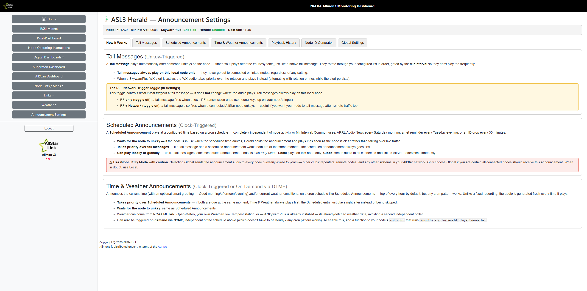
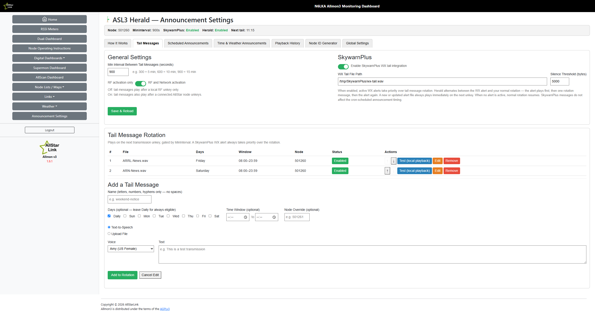
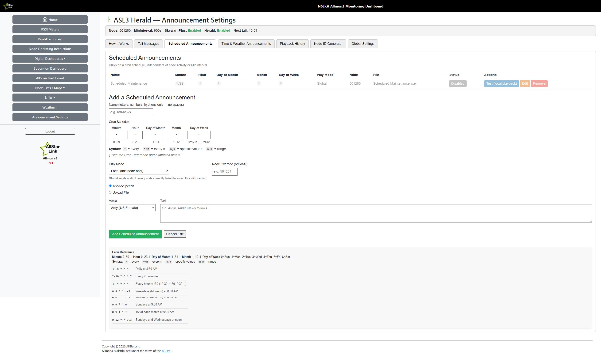
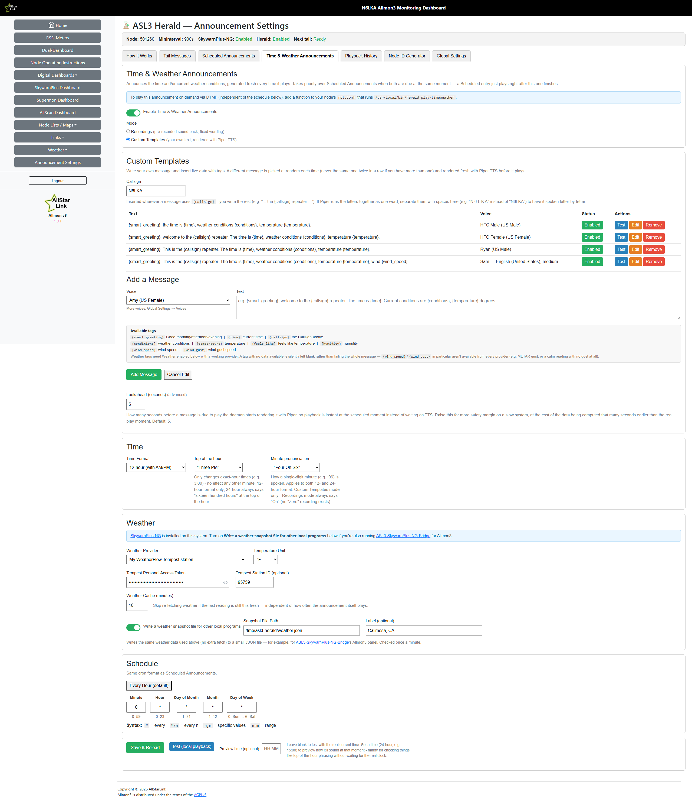
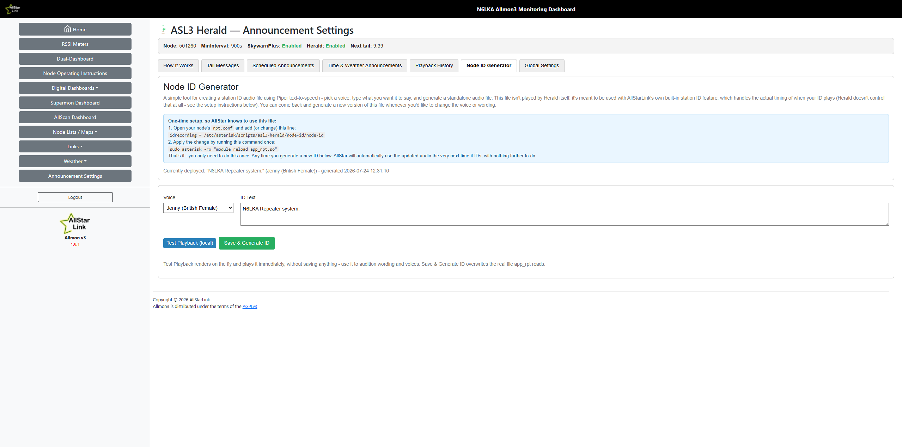

**A full-featured announcement and audio suite for ASL3/app_rpt.**

`asl3-herald` started as a drop-in replacement for the native `app_rpt` tail message function and has grown into a complete announcement toolkit: reliable unkey-triggered tail messages, cron-style scheduled announcements, SkywarnPlus weather alert integration with priority playback (works with classic SkywarnPlus or [SkywarnPlus-NG](https://github.com/hardenedpenguin/SkywarnPlus-NG) — see [SkywarnPlus Integration](#skywarnplus-integration)), built-in time & weather announcements (either a pre-recorded sound pack or your own Piper-TTS-rendered custom messages), a station ID audio generator, neural TTS voices throughout, and an optional web UI for Allmon3 and Supermon (v7.4+ and v8+) — all things the built-in tail message either doesn't support or handles unreliably.

---

## What It Does

`asl3-herald` covers these core functions:

- **Tail Messages** — unkey-triggered, reactive to node activity:
  - **Reliable unkey detection** — uses the Asterisk Manager Interface (AMI) for real-time, event-driven unkey detection that fires at the actual unkey (before the courtesy tone), giving a seamless native-feel tail message; falls back to the legacy `rpt stats` kerchunk counter if AMI credentials aren't available
  - **Network keyup support** — with AMI active, the optional `NetworkKeyupTrigger` setting also fires tail messages after a connected AllStar node unkeys (not just local RF)
  - **Rotating messages** — cycles through a list of announcement files in order with a configurable minimum interval between plays
  - **SkywarnPlus WX integration** — when weather alerts are active, plays the SkywarnPlus `wx-tail.wav` file instead of the normal rotation (WX always takes priority)
  - **Optional day/time-window gating per entry** — a rotation entry can be restricted to specific days of the week and/or a time-of-day window (e.g. a net-announcement tail message that's only eligible Tuesday evenings); entries without gating stay eligible all the time, same as before

- **Scheduled Announcements** — clock-triggered, independent of node activity:
  - Plays a specific file on a **cron-style schedule** (`MIN HOUR DOM MON DOW`) — fire once at a specific time, every N minutes, on selected days, and more
  - **Local or global playback** — each scheduled announcement can play locally on this node only (`rpt localplay`, the default) or globally to all connected/linked nodes (`rpt playback`)
  - **Waits for unkey** — if the node is currently keyed when a scheduled announcement is due, it holds off rather than playing over live traffic, and keeps checking until the node unkeys
  - **Takes precedence over tail messages** — if a scheduled announcement and a tail message would both fire at the same moment, the scheduled announcement always plays; the tail message simply retries on its next unkey once the announcement has finished, with no penalty against `MinInterval`
  - **Per-announcement enable/disable** — disable an entry without removing it (`herald toggle-schedule <name>` or the web UI Status toggle); re-enable it the same way
- **Per-entry enable/disable for tail messages** — disable individual rotation entries without removing them (`herald toggle-rotation <name>` or the web UI Status toggle); disabled entries are skipped during the unkey cycle

- **Time & Weather Announcements** — a built-in, enhanced take on the classic `saytime.pl` / `weather.sh` scripts many ASL3/AllStar repeaters have run for years, so there's no separate program to install and keep in sync:
  - Announces the current time (12- or 24-hour, with an optional "Good morning/afternoon/evening" smart greeting) and/or current weather conditions — time only, weather only, or both, independently configurable
  - Runs on the same cron-style schedule as Scheduled Announcements (top of every hour by default, but any pattern works) and **takes priority over Scheduled Announcements** if both are due at the same moment
  - Also triggerable **on demand over DTMF** (map a function in `rpt.conf` to `herald play-timeweather`), independent of the schedule
  - Weather can come from NOAA METAR, Open-Meteo, your own WeatherFlow Tempest station, or any Personal Weather Station uploading to Weather Underground (including a Tempest station also configured to feed WU) — Tempest, Open-Meteo, and METAR all include wind speed/direction/gust in addition to temperature, feels-like, humidity, and condition
  - **Two modes**: **Recordings** (default) builds the announcement from a pre-recorded sound pack — fast, fixed wording. **Custom Templates** lets you write your own message(s) with tags (`{smart_greeting}` `{time}` `{conditions}` `{temperature}` `{feels_like}` `{humidity}` `{wind_speed}` `{wind_gust}` `{callsign}`), rendered fresh with Piper TTS each time at an adjustable speech speed (0.5x–2.0x, per message); with more than one message configured, a different one is picked at random each occurrence (never the same one twice in a row). Rendering happens a few seconds ahead of the scheduled moment (configurable) so playback is still instant when it's due. A tag left blank because the current provider/reading has no data for it (e.g. no gust, or a provider with no wind at all) is silently omitted rather than failing the whole message.
  - **Top-of-the-hour phrasing** — in 12-hour format, choose whether an exact-hour time (e.g. 3:00) says "Three PM" (default) or "Three O'Clock PM"; no effect any other minute. 24-hour format always says "hundred hours" at the top of the hour (e.g. "Sixteen Hundred Hours"), matching the original Time-Weather-Announce script's convention.
  - **Minute pronunciation** (Custom Templates mode) — choose "Oh" or "Zero" for single-digit minutes, e.g. "Four Oh Six" vs "Four Zero Six" (12-hour) or "Sixteen Oh Six" vs "Sixteen Zero Six" (24-hour).
  - **Test with any time, not just right now** — the Test button (and `herald test-timeweather --at HH:MM`) can preview as if it were any time of day, so checking things like the o'clock phrasing above or the smart-greeting boundaries doesn't mean waiting for the real clock to get there.

- **Node ID Generator** — a simple tool for creating a station ID audio file with Piper TTS (pick a voice, type the wording), with a Test Playback button to audition it before saving. The generated file isn't used by Herald itself — it's meant to be used with AllStarLink's own built-in station ID feature, which keeps handling the actual timing of when your ID plays. Point `idrecording =` at Herald's generated file once (see Node ID Generator below) and reload.

Both Tail Messages and Scheduled Announcements can be edited in place (name, text, voice, schedule, play mode) via `herald edit-rotation` / `herald edit-schedule` or the web UI, instead of removing and re-adding.

**Node targeting for `multinodes=` setups:** any rotation or scheduled entry can optionally carry a `Node` override, targeting a specific node number for playback instead of the daemon's own configured `Node` — useful when one AMI connection serves several node numbers (Allmon3's `multinodes=`) and you want a given announcement to go out on a particular one.

Plus:
- **Piper neural TTS** — generate announcements from text with natural-sounding voices (6 included), with festival/espeak-ng as a fallback
- **Adjustable TTS speech speed** — per tail message, scheduled announcement, Time & Weather template message, or the Node ID, a `0.5x`–`2.0x` slider in the Add/Edit form. Uses Piper's own `--length-scale` where available; the festival fallback uses sox's tempo effect instead (espeak-ng scales its own words-per-minute rate directly)
- **Web UI** — optional browser-based management linked from Allmon3 or Supermon (v7.4+ and v8+), gated behind each app's own login
- **Instant disable/enable** — `herald toggle` / `herald enable` / `herald disable`, no config edits or restarts needed
- **Live config reload** — `herald reload` sends SIGHUP to pick up config changes immediately
- **Reorderable rotation** — move a rotation entry earlier/later in the cycle from the web UI or CLI, no remove-and-re-add needed
- **Playback history** — the last 200 plays (rotation, WX, scheduled, and manual test plays) are logged with timestamp, node, and play mode, viewable in the web UI's Playback History tab
- **Test playback, always local** — the Play/Test button (web UI and `herald play`) always plays immediately on this node only, regardless of a scheduled announcement's configured `PlayMode` — it's for confirming an entry sounds right, never a live broadcast
- **Config backup/restore** — export the full rotation/scheduled/settings config as a JSON file, or restore from one, via the Settings tab or `herald export-config` / `herald import-config`
- **Missing-file health check** — a rotation or scheduled entry whose WAV file no longer exists on disk is flagged (`herald status`'s missing-file count, `herald list`, and a badge in the web UI) instead of failing silently
- **Version display + update check** — the installed version is shown in the web UI's Settings tab, with a "Check for Updates" button that compares it against the latest `main` release on GitHub. Herald also checks automatically once a day in the background; if a newer release is available, an "Update available" badge appears in the header (click it to open that release on GitHub in a new tab) — no need to remember to check manually

---

## Screenshots

**How It Works** — a plain-language overview of Tail Messages, Scheduled Announcements, and Time & Weather Announcements, shown before you touch any settings.


**Tail Messages** — General Settings, SkywarnPlus integration, the rotation table, and the add-message form.


**Scheduled Announcements** — cron-driven announcements with a live schedule picker and reference table.


**Time & Weather Announcements** — Custom Templates mode, with tag-based messages rendered fresh by Piper TTS each time.


**Node ID Generator** — generate a station ID recording with Piper TTS, test it locally, and see exactly what to add to `rpt.conf`.


---

## Installation

**Stable (recommended):** installs from `main` — the tested, working release.

```bash
curl -fsSL -H "Cache-Control: no-cache" https://raw.githubusercontent.com/N6LKA/ASL3-Herald/main/install.sh | sudo bash
```

**Development (testing only):** installs from `develop` — whatever's currently being worked on ahead of the next release.

> ⚠️ **Warning:** `develop` may contain incomplete, untested, or broken features at any given time. Only use this on a system where you can tolerate things breaking (or reinstall from `main` to recover). Don't use it on a repeater or node you depend on for daily use.

```bash
curl -fsSL "https://github.com/N6LKA/ASL3-Herald/archive/refs/heads/develop.tar.gz" \
  | tar -xzO ASL3-Herald-develop/install.sh \
  | sudo bash -s -- --branch develop
```

This tarball form is used instead of the raw GitHub URL because `raw.githubusercontent.com` is CDN-cached and can serve a stale `install.sh` for an extended period — the tarball download goes through GitHub's codeload service, which always returns the current commit.

The installer will:
1. Install `python3-yaml`, `sox`, and `libsox-fmt-mp3` if not already present
2. Install Piper TTS 1.2.0 (binary + the default `en_US-amy-medium` voice) into the shared `/var/lib/piper-tts` — more voices can be installed later from the web UI's Voices tab
3. Copy `asl3-herald.py` to `/usr/local/bin/asl3-herald/`
4. Install the `herald` management command to `/usr/local/bin/herald`
5. Create `/etc/asterisk/scripts/asl3-herald/` with an example config (if no config exists)
6. Install and enable the `asl3-herald` systemd service, and start it automatically
7. Install the web UI to `/var/www/html/asl3-herald/` — installs `apache2` + `php` first if neither Allmon3 nor Supermon is already present, then installs a dedicated page directly into Allmon3's and/or Supermon's own directory (with a sidebar/footer link to it) for whichever is detected

**After installation:**

1. Edit the config: `sudo nano /etc/asterisk/scripts/asl3-herald/asl3-herald.conf`
2. Check it's running: `herald status`

---

## Uninstalling

```bash
curl -fsSL -H "Cache-Control: no-cache" https://raw.githubusercontent.com/N6LKA/ASL3-Herald/main/uninstall.sh | sudo bash
```

By default this removes the daemon, `herald` CLI, systemd service, web UI, sudoers rule, and the Allmon3/Supermon integration lines it added — while **preserving** your config, announcements, state, and Piper TTS install so a future reinstall picks up where you left off. To also remove those:

```bash
curl -fsSL -H "Cache-Control: no-cache" https://raw.githubusercontent.com/N6LKA/ASL3-Herald/main/uninstall.sh | sudo bash -s -- --purge-all
```

(`--purge-config` and `--purge-piper` are available individually too.)

---

## Configuration

Config file: `/etc/asterisk/scripts/asl3-herald/asl3-herald.conf`

| Setting | Default | Description |
|---|---|---|
| `Node` | _(required)_ | Your ASL3 node number |
| `Debug` | `false` | Enable verbose debug logging |
| `TailMessage.Enable` | `true` | Enable/disable tail message function |
| `TailMessage.MinInterval` | `300` | Minimum seconds between tail messages |
| `TailMessage.NetworkKeyupTrigger` | `false` | When enabled, tail messages also fire after a connected AllStar node unkeys (not just local RF); requires AMI |
| `TailMessage.Rotation` | _(empty)_ | List of rotation entries (WAV file paths, or dicts with `File` plus optional `Days`/`TimeStart`/`TimeEnd`/`Node`) |
| `TailMessage.Rotation[].Days` | _(always eligible)_ | Optional: `daily` (default) or a list, e.g. `[tuesday]` — restricts this entry to those days |
| `TailMessage.Rotation[].TimeStart` / `TimeEnd` | _(none)_ | Optional: `HH:MM` window this entry is eligible in; omit either side for open-ended |
| `TailMessage.Rotation[].Node` | _(daemon's `Node`)_ | Optional: target a specific node number for this entry (multinodes= setups) |
| `TailMessage.Rotation[].Enabled` | `true` | Set to `false` to disable an entry without removing it; re-enable with `herald toggle-rotation <name>` or the web UI |
| `TailMessage.Rotation[].Speed` | `1.0` | TTS speech-speed multiplier, `0.5`-`2.0` (ignored on file-uploaded entries; takes effect the next time the entry's audio is (re)generated) |
| `TailMessage.SkywarnPlus.Enable` | `true` | Enable SkywarnPlus WX tail integration |
| `TailMessage.SkywarnPlus.WxTailFile` | `/var/lib/skywarnplus-ng/data/wx-tail.wav` | Path to the WX tail WAV — matches SkywarnPlus-NG's own default; set to `/tmp/SkywarnPlus/wx-tail.wav` for the classic fork |
| `TailMessage.SkywarnPlus.SilenceThreshold` | `5000` | File size (bytes) to distinguish active alerts from silence |
| `TailMessage.SkywarnPlus.NGEnable` | `false` | See [SkywarnPlus-NG integration](#skywarnplus-ng-integration) — needed alongside `WxTailFile` above when running NG, not needed for the classic fork |
| `TailMessage.SkywarnPlus.NGApiBase` | `http://127.0.0.1:8100` | NG's local dashboard API |
| `TailMessage.SkywarnPlus.NGPollIntervalSec` | `30` | How often Herald polls NG's API for change detection |
| `Scheduled[].Name` | _(required)_ | Unique name for the scheduled announcement |
| `Scheduled[].Cron` | _(required)_ | 5-field cron expression: `MIN HOUR DOM MON DOW` |
| `Scheduled[].File` | _(required)_ | Path to WAV file to play |
| `Scheduled[].PlayMode` | `local` | `local` (this node only) or `global` (all connected/linked nodes) |
| `Scheduled[].Node` | _(daemon's `Node`)_ | Optional: target a specific node number for this entry (multinodes= setups) |
| `Scheduled[].Enabled` | `true` | Set to `false` to disable an entry without removing it; re-enable with `herald toggle-schedule <name>` or the web UI |
| `Scheduled[].Speed` | `1.0` | TTS speech-speed multiplier, `0.5`-`2.0` (ignored on file-uploaded entries) |

**AMI credentials** are never stored in `asl3-herald.conf`. The daemon reads them automatically at startup and on every config reload from `/etc/allmon3/allmon3.ini` (Allmon3 users) or `/etc/asterisk/manager.conf` (Supermon and other frontends). If neither file yields usable credentials, herald falls back to the legacy CLI kerchunk counter (local RF unkeys only).

**Example config:**

```yaml
Node: "YOUR_NODE_NUMBER"
Debug: false

TailMessage:
  Enable: true
  MinInterval: 300
  NetworkKeyupTrigger: false
  Rotation:
    - /etc/asterisk/scripts/asl3-herald/announcements/tail1.wav
  SkywarnPlus:
    Enable: true
    WxTailFile: /var/lib/skywarnplus-ng/data/wx-tail.wav
    SilenceThreshold: 5000

Scheduled:
  - Name: "ARRL Audio News"
    Cron: "30 7 * * 6"           # Saturdays at 7:30 AM
    File: /etc/asterisk/scripts/asl3-herald/announcements/arrl-news.wav
    Enabled: true

  - Name: "Second Saturday Breakfast Net"
    Cron: "0 8 8-14 * 6"         # 2nd Saturday (DOM 8-14, DOW 6) at 8:00 AM
    File: /etc/asterisk/scripts/asl3-herald/announcements/breakfast-net.wav
    Enabled: true
```

---

## Node ID Generator

A simple tool (Node ID Generator tab in the web UI, or `herald set-node-id`/`test-node-id` on the CLI) for creating a station ID audio file with Piper TTS — pick a voice, type what you want it to say, and generate a standalone audio file. This file isn't played by Herald itself; it's meant to be used with AllStarLink's own built-in station ID feature, which keeps handling the actual timing of when your ID plays. You can regenerate it any time you want to change the voice or wording.

**One-time setup, so AllStar knows to use this file:**

1. Open your node's `rpt.conf` and add (or change) this line:
   ```
   idrecording = /etc/asterisk/scripts/asl3-herald/node-id/node-id
   ```
2. Apply the change by running this command once:
   ```bash
   sudo asterisk -rx "module reload app_rpt.so"
   ```

That's it — you only need to do this once. Any time you generate a new ID from the Node ID Generator tab (or `herald set-node-id`), AllStar automatically uses the updated audio the very next time it IDs, with nothing further to do.

`idtalkover` (the CW/voice ID played over an active signal) is untouched by this feature — it keeps using whatever's already configured in `rpt.conf`.

---

## herald Command

**General:**

| Command | Description |
|---|---|
| `herald status` | Show daemon status and config summary |
| `sudo herald enable` | Remove disable flag and start daemon |
| `sudo herald disable` | Set disable flag — tail messages suppressed immediately |
| `sudo herald toggle` | Flip enabled/disabled state |
| `sudo herald reload` | Reload config file without restarting (SIGHUP) |
| `herald list-json` | Print config as JSON (used by the web UI) |
| `herald voices [--json]` | List available Piper voices |
| `herald playback-history` | Print recent playback history as JSON |
| `herald export-config` | Print the full config as JSON (for backup) |
| `sudo herald import-config <path>` | Restore the full config from an exported JSON file (replaces everything) |

**Tail Messages:**

| Command | Description |
|---|---|
| `sudo herald add "<text>" [--name <name>] [--voice <voice>] [--days daily\|d1,d2] [--time-start HH:MM] [--time-end HH:MM] [--node <n>]` | Generate TTS WAV and add to rotation |
| `sudo herald add-file <path> [--name <name>] [--days daily\|d1,d2] [--time-start HH:MM] [--time-end HH:MM] [--node <n>]` | Copy an existing WAV into rotation |
| `sudo herald edit-rotation <name> [--new-name <n>] [--text "<text>"] [--voice <v>] [--file <path>] [--days ...] [--time-start HH:MM] [--time-end HH:MM] [--node <n>]` | Edit an existing rotation entry in place |
| `sudo herald reorder-rotation <name> <up\|down>` | Move a rotation entry earlier/later in the cycle |
| `sudo herald toggle-rotation <name>` | Enable or disable a tail message rotation entry without removing it |
| `herald list` | List rotation + scheduled announcements (flags entries with a missing file) |
| `sudo herald remove <name>` | Remove a rotation file or scheduled announcement |
| `sudo herald play <name>` | Test-play an announcement on the node immediately (always local, ignores `PlayMode`) |

`--days`/`--time-start`/`--time-end` restrict a rotation entry to specific days-of-week and/or a time-of-day window; leave unset for an entry that's always eligible. `--node` targets a specific node number instead of the daemon's configured `Node`.

**Scheduled Announcements:**

| Command | Description |
|---|---|
| `sudo herald add-schedule "<text>" --name <name> --cron "MIN HOUR DOM MON DOW" [--voice <voice>] [--play-mode local\|global] [--node <n>]` | Generate TTS WAV and schedule it |
| `sudo herald add-schedule-file <path> --name <name> --cron "MIN HOUR DOM MON DOW" [--play-mode local\|global] [--node <n>]` | Schedule an existing WAV file |
| `sudo herald edit-schedule <name> [--new-name <n>] [--cron "MIN HOUR DOM MON DOW"] [--play-mode local\|global] [--text "<text>"] [--voice <v>] [--file <path>] [--node <n>]` | Edit an existing scheduled announcement in place |
| `sudo herald toggle-schedule <name>` | Enable or disable a scheduled announcement without removing it |

**Cron field reference:** `MIN` (0–59)  `HOUR` (0–23)  `DOM` = Day of Month (1–31)  `MON` = Month (1–12)  `DOW` = Day of Week (0=Sun, 1=Mon … 6=Sat). Use `*` for every, `*/n` for every-n, `n,m` for specific values, `n-m` for a range.

```bash
sudo herald add-schedule "ARRL Audio News follows" --name arrl-news --cron "30 7 * * 6"   # Saturdays at 7:30 AM
sudo herald add-schedule "Net check-in time" --name net-checkin --cron "*/20 * * * *"      # every 20 minutes
sudo herald add-schedule "Hourly ID" --name hourly-id --cron "30 * * * *"                  # every hour at :30
```

A scheduled announcement waits for the node to unkey before playing (rather than interrupting live traffic) and always takes precedence over a tail message due at the same moment.

---

## Text-to-Speech

`herald add` and `herald add-schedule` prefer **Piper** (neural TTS, installed by `install.sh`) for natural-sounding voices, and fall back to `festival` or `espeak-ng` if Piper isn't available.

Piper voices live at `/var/lib/piper-tts` — the same shared location [SkywarnPlus-NG](#skywarnplus-ng-integration) and ASL3's own `asl3-tts` package use. Install a voice through any of the three and it's usable by all of them; nothing is duplicated.

`install.sh` installs only the default voice (`en_US-amy-medium`) up front. Browse and install any of the other 160+ available voices from the **Voices** box on the web UI's **Global Settings** tab (region + voice picker, "Install Voice" button) — no restart or reload needed, and the new voice shows up immediately in every voice dropdown (Tail Messages, Scheduled Announcements, Time & Weather Templates, Node ID Generator). Once a voice is installed, the same box shows a "Remove Voice" button instead (the default voice can't be removed); already-generated announcements keep playing fine after a voice is removed, but editing one that still references it will fail until a different voice is picked or it's reinstalled.

```bash
herald voices                                              # list installed voices
herald catalog-voices                                       # full catalog (region/language/installed status), as JSON
sudo herald install-voice en_US-joe-medium                  # install a voice from the CLI instead of the web UI
sudo herald remove-voice en_US-joe-medium                   # remove an installed voice from the CLI
sudo herald add "Net starts in 5 minutes" --voice en_US-joe-medium --name net-warning
```

Fallback TTS engines, if you don't want Piper's disk/bandwidth footprint:
```bash
sudo apt install festival sox
# or
sudo apt install espeak-ng sox
```

For a non-English voice, remember Herald just passes whatever text you type straight to Piper — write your announcement text in that language too. A voice not in Herald's catalog (or installed by some other means) still shows up in every dropdown once its `.onnx`/`.onnx.json` pair is in `/var/lib/piper-tts` — just labeled by its raw filename instead of a friendly display name.

---

## Web UI

An optional browser-based UI for managing both Tail Messages and Scheduled Announcements. The shared UI and JSON API live at `/var/www/html/asl3-herald/`, but the actual entry points are installed *inside* Allmon3's and Supermon's own directories — not as a separate app linked via cookie-forwarding. The two functions are kept on clearly separate panels in the UI, matching the CLI's own Tail Message / Scheduled Announcement split — they're never mixed into one list.

- **Allmon3**: `install.sh` installs `asl3-herald.html` directly into Allmon3's own web root (`/usr/share/allmon3/`, alongside `index.html`) and appends a `[Herald]` entry to the bottom of `/etc/allmon3/menu.ini` (Allmon3's own supported sidebar-customization mechanism) pointing at it. Because the page lives inside Allmon3's own directory, it loads Allmon3's real `functions.js`/`index.js` unmodified — same header/sidebar chrome as any other Allmon3 page, and a same-origin `master/auth/check` fetch for login detection. (A page living outside Allmon3's own directory can't reliably read Allmon3's session cookie server-side — its `Path` ends up scoped to Allmon3's own API prefix — which is why an earlier design based on a separate PHP page cookie-forwarding to Allmon3's internal port didn't reliably work.)
- **Optional**: `install.sh` also appends a rule to `/etc/allmon3/custom.css` that hides the sidebar link entirely until you're logged into Allmon3, using Allmon3's own stock `body.logged-in`/`body.logged-out` class toggle. This is cosmetic only — the page itself still gates its content on real login status regardless of whether the link is visible.
- **Supermon (v7.4+ and v8+)**: `install.sh` installs `asl3-herald.php` directly into Supermon's own directory (`/var/www/html/supermon/`) and adds a link at the bottom of the page after logging in (added to `footer.inc`, inside Supermon's own existing login-conditional block — so it's already hidden until logged in, natively). Because the page lives inside Supermon's own directory, it includes Supermon's real `session.inc`/`header.inc`/`footer.inc` unmodified — same nav and login dialog as any other Supermon page, and the same named session cookie (`supermon61`) Supermon itself uses, so login detection always matches Supermon's actual state.
- A **How It Works** tab explains the difference between Tail Messages and Scheduled Announcements, the RF/Network trigger toggle, and the Global play mode caution — useful for users who are new to the system or sharing access with others.
- Both pages support adding announcements via typed text (with Piper voice selection) or by uploading an existing `.wav`/`.mp3` file (auto-converted to 8kHz mono).
- **Playback History tab** — the last 200 plays (rotation, WX, scheduled, manual test) with timestamp, node, and play mode.
- **Settings tab** also shows the installed version with a "Check for Updates" button (compares against `main`'s `version.txt` via GitHub's API), plus a Backup & Restore card to download the full config as JSON or restore from a previously exported file. The daemon also runs this same check automatically once a day in the background and shows an "Update available" badge in the header when a newer release exists (clicking it opens that release on GitHub in a new tab) — a manual click updates the badge immediately too, rather than waiting for the next automatic check.
- Rotation entries in the Tail Messages tab have Up/Down buttons to reorder the cycle, and any entry (rotation or scheduled) whose WAV file no longer exists on disk shows a "MISSING FILE" badge.
- All mutations go through the same `herald` CLI used at the command line — the web UI never edits the YAML config directly. `www-data` is granted narrow, passwordless `sudo` access to run `herald` only (see `/etc/sudoers.d/asl3-herald-web`). The JSON API endpoints themselves are not independently re-verified against Allmon3/Supermon login state (the display pages are gated, but the raw API URLs aren't) — a deliberate simplicity/portability tradeoff, since properly closing that gap would require a per-user Apache config change that isn't reliable across arbitrary installs. The API's own blast radius is narrow regardless: `www-data` can only run the `herald` CLI, nothing else.

If neither Allmon3 nor Supermon is detected at install time, `install.sh` installs `apache2` + `php` on its own so the shared UI still has somewhere to run. `menu.ini` and `custom.css` changes are always appended to the end of the file (never inserted in the middle) so they don't disturb any existing customizations, and both are idempotent — re-running `install.sh` won't duplicate them. The Allmon3/Supermon pages themselves are always overwritten on install/update, since they're fully managed by asl3-herald.

---

## Service Commands

```bash
sudo systemctl start asl3-herald      # Start the daemon
sudo systemctl stop asl3-herald       # Stop the daemon
sudo systemctl restart asl3-herald    # Restart the daemon
sudo systemctl status asl3-herald     # Show service status
journalctl -u asl3-herald -f          # Follow live log output
```

---

## Files

| Path | Description |
|---|---|
| `/usr/local/bin/asl3-herald/asl3-herald.py` | Main daemon (also exposes CLI subcommands used by `herald`) |
| `/usr/local/bin/asl3-herald/version.txt` | Version file |
| `/usr/local/bin/herald` | Management command |
| `/etc/asterisk/scripts/asl3-herald/asl3-herald.conf` | Configuration file |
| `/etc/asterisk/scripts/asl3-herald/asl3-herald.state` | Runtime state (rotation index, last played time, playback history) |
| `/etc/asterisk/scripts/asl3-herald/asl3-herald-disabled` | Disable flag (presence disables tail messages) |
| `/etc/asterisk/scripts/asl3-herald/announcements/` | Announcement WAV files |
| `/etc/systemd/system/asl3-herald.service` | systemd service unit |
| `/var/www/html/asl3-herald/` | Shared UI fragment/JS and JSON API (PHP) |
| `/var/www/html/asl3-herald/img/` | Logo assets (icon + banner), used by the Allmon3/Supermon page headers |
| `/usr/share/allmon3/asl3-herald.html` | Allmon3 entry point (installed alongside Allmon3's own `index.html`) |
| `/var/www/html/supermon/asl3-herald.php` | Supermon entry point (installed alongside Supermon's own `index.php`) |
| `install.sh` / `uninstall.sh` (repo root) | Installer / uninstaller — not installed on the node itself |
| `/etc/sudoers.d/asl3-herald-web` | Narrow passwordless sudo rule for `www-data` to run `herald` |
| `/opt/piper/` | Piper TTS binary |
| `/var/lib/piper-tts/` | Piper voice models (shared with SkywarnPlus-NG / asl3-tts) |

---

## How It Works

`asl3-herald` uses the **Asterisk Manager Interface (AMI)** for real-time unkey detection. The AMI connection runs on loopback (127.0.0.1) — no internet involved. AMI credentials are read automatically from `/etc/allmon3/allmon3.ini` (Allmon3) or `/etc/asterisk/manager.conf` (Supermon / other frontends) on startup and on every SIGHUP config reload, so changes to either file are picked up without touching herald's own config.

With AMI active, the daemon polls XStat every 0.5 seconds and watches for the `RPT_RXKEYED` variable to transition from 1 to 0 — this fires at the actual unkey, before the courtesy tone, giving a native-feel seamless tail message. When `NetworkKeyupTrigger` is enabled, it also polls SawStat and fires on any connected node's PTT transitioning 1 to 0 (network unkey). If AMI credentials aren't available, the daemon falls back to polling the `rpt stats` kerchunk counter (local RF unkeys only, fires after the courtesy tone).

Every poll, **scheduled announcements are checked first**, before the unkey/tail-message logic. When an unkey is detected, the daemon then checks in priority order:
1. **Minimum interval** — if not enough time has passed since the last tail message, skip
2. **Scheduled announcement in progress** — if one just started playing (see below), skip this unkey; it isn't counted against `MinInterval`, so the tail message simply retries on the next unkey
3. **SkywarnPlus WX alert** — if the `wx-tail.wav` file is larger than `SilenceThreshold` bytes, an alert is active
4. **Rotation** — otherwise, play the next *eligible* file in the rotation list (skipping any with `Days`/`TimeStart`/`TimeEnd` gating that doesn't currently match) and advance the index

A newly-appeared or changed WX alert always plays immediately, taking priority over the rotation. But a **persistent** alert (unchanged since it last played — detected via `wx-tail.wav`'s own modification time, not a separate/optional SkywarnPlus feed) alternates with the rotation on each unkey instead of playing every single time, so a long-running alert (common in some areas, e.g. summer heat warnings) doesn't shut the rotation out entirely. As soon as the alert changes or a new one appears, it immediately jumps back to the front of the line.

**Scheduled announcements** run on a separate time-based path, unaffected by the tail message interval or node activity. They are driven by a standard 5-field cron expression (`MIN HOUR DOM MON DOW`) and can fire once at a specific time, at a repeating interval (e.g. `*/20 * * * *` = every 20 minutes), or on any cron-expressible schedule. Each entry fires at most once per matching minute; a `*/20` entry fires three times an hour, not once per day. If the node is currently keyed when a scheduled announcement is due, it holds off and keeps re-checking every poll — even after the matching minute has passed — until the node unkeys, rather than missing the announcement or talking over live traffic. Once a scheduled announcement plays, its estimated audio duration (via `soxi`, or an 8-second fallback estimate) holds off any tail message for that long, so the two never overlap — this is also how a scheduled announcement takes precedence when both would fire at the same moment.

**Time & Weather Announcements** use the same cron-based path as Scheduled Announcements, but are checked first, so they take priority if both are due at the same moment — the Scheduled entry simply retries on the next poll cycle rather than being skipped. The announcement audio (time and/or weather, per config) is regenerated fresh every time it plays, unlike a fixed recording. It can also be triggered on demand via a DTMF function mapped to `herald play-timeweather`, independent of the cron schedule — logged to Playback History as a normal occurrence (not a test), without suppressing the next real scheduled occurrence.

In **Custom Templates mode**, the daemon computes when the schedule will next fire and starts rendering the chosen message with Piper `LookaheadSeconds` ahead of that moment (as a background process, so it never blocks unkey detection or anything else in the poll loop) — by the time the scheduled minute arrives, the file is already sitting there ready to play, same instant feel as Recordings mode. If the node is keyed when that moment arrives, it waits for unkey exactly like Recordings mode; if rendering somehow isn't finished in time, the daemon gives it a short grace period before skipping that occurrence rather than playing nothing or a broken file. DTMF and Test plays render synchronously on demand instead, since those already run outside the daemon's shared poll loop.

State (rotation index, WX alternation, scheduled "waiting for unkey" status, and last played times) is saved to a JSON file so it survives service restarts.

---

## SkywarnPlus Integration

**Tail Messages' WX alert integration** (`TailMessage.SkywarnPlus`) — no changes to SkywarnPlus are required; Herald just reads the existing `wx-tail.wav` file SkywarnPlus already generates:

- **No active alerts:** `wx-tail.wav` is a small silent file (~1644 bytes)
- **Active alerts:** `wx-tail.wav` contains the weather alert audio (typically 50KB+)

Set `SilenceThreshold: 5000` (the default) to reliably distinguish between the two. This works with any classic SkywarnPlus install (any fork, or the original archived [Mason10198/SkywarnPlus](https://github.com/Mason10198/SkywarnPlus) upstream).

There is no dedicated Time & Weather weather provider for reading a classic SkywarnPlus install's already-fetched data — use `TimeWeather.Weather.Provider: tempest`/`wunderground`/`metar`/`openmeteo` directly (see [Time & Weather](#time--weather-announcements) above) if you want weather announcements independent of your SkywarnPlus setup.

### SkywarnPlus-NG integration

[SkywarnPlus-NG](https://github.com/hardenedpenguin/SkywarnPlus-NG) is a separate, independent rewrite with its own tail-message file (silent when clear, TTS'd alert audio when active — configurable in its own dashboard under Alert Behavior, default path `/var/lib/skywarnplus-ng/data/wx-tail.wav`). Point `WxTailFile` straight at that path — Herald reads and plays it directly, no bridge needed for the audio itself. This is also `WxTailFile`'s new default, so a fresh install already matches NG's default location.

The one thing NG does differently from classic SkywarnPlus: it rewrites that file on *every* poll cycle regardless of whether the alert set actually changed (classic SkywarnPlus only rewrites on a real change). Since the WX/rotation alternation above relies on the file's mtime to know "is this genuinely new," that would make WX replay on every unkey instead of ever alternating with rotation. So when running NG, also set:

```yaml
TailMessage:
  SkywarnPlus:
    Enable: true
    WxTailFile: /var/lib/skywarnplus-ng/data/wx-tail.wav   # matches NG's own default
    NGEnable: true
    NGApiBase: http://127.0.0.1:8100   # NG's local dashboard API - default port
    NGPollIntervalSec: 30
```

With `NGEnable` on, Herald separately polls NG's local `/api/alerts` on its own schedule purely to detect a genuine change in the active-alert set, and uses that instead of the file's mtime for the alternation decision — `WxTailFile`/`SilenceThreshold` and the alternation behavior itself work exactly the same either way. Leave `NGEnable` off if you're on classic SkywarnPlus, whose own file-rewrite behavior already matches what the mtime check expects.

For weather announcements with NG, use `TimeWeather.Weather.Provider: tempest`/`wunderground`/`metar`/`openmeteo` — NG has no shared weather file of its own. If you're also running [ASL3-SkywarnPlus-NG-Bridge](https://github.com/N6LKA/ASL3-SkywarnPlus-NG-Bridge) for Allmon3/Supermon alert panels, set `TimeWeather.Weather.SnapshotEnable: true` so Herald writes the current-conditions snapshot that bridge's Allmon3 panel reads (see its README for the exact contract).

---

## Support the Project

If asl3-herald has been useful on your repeater or node, please consider supporting its development!

<p align="center"><a href="https://www.paypal.me/LarryAycock"></a></p>

---

## License

GPLv3 © 2026 Larry Aycock (N6LKA)

This software is free and open source. You may use, modify, and redistribute it, but derivative works must remain open source under the same license — it may not be resold or relicensed as proprietary software.

See [LICENSE](LICENSE) for details.
